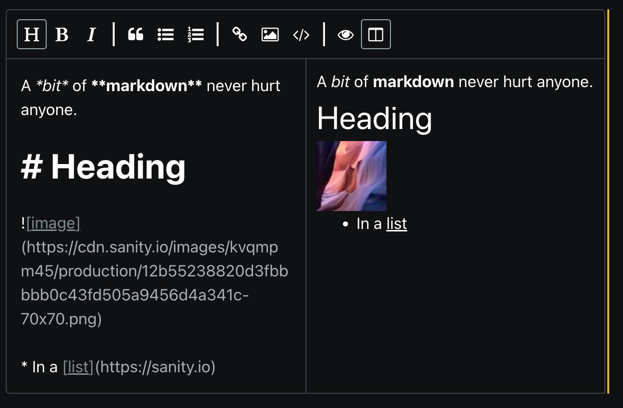

# sanity-plugin-markdown

> This is a **Sanity Studio v3** plugin.
> For the v2 version, please refer to the [v2-branch](https://github.com/sanity-io/sanity-plugin-markdown/tree/studio-v2).

## What is it?

A Markdown editor with preview for Sanity Studio. 

Supports Github flavored markdown and image uploads. 
You can either drag image(s) into the editor or click the bottom bar to bring up a file selector. 
The resulting image URL(s) are inserted with a default width parameter which you can change to your liking using the [Sanity image pipeline parameters](https://www.sanity.io/docs/image-urls).

The current version is a wrapper around [React SimpleMDE (EasyMDE) Markdown Editor](https://github.com/RIP21/react-simplemde-editor#react-simplemde-easymde-markdown-editor),
and by extension, [EasyMDE](https://github.com/Ionaru/easy-markdown-editor).



## Installation
Install `sanity-plugin-markdown` and `easymde@2` (peer dependency).

```
npm install --save sanity-plugin-markdown easymde@2
```

## Usage

Add it as a plugin in sanity.config.ts (or .js):

```js
import { markdownSchema } from "sanity-plugin-markdown";

export default defineConfig({
  // ...
  plugins: [
    markdownSchema(),
  ] 
})
```

Then, declare a field in your schema to be `markdown`

```javascript
const myDocument = {
  type: "document",
  name: "myDocument",
  fields: [
    {
      type: "markdown",
      description: "A Github flavored markdown field with image uploading",
      name: "bio"
    }
  ]
}
```
### Next.js compatability
Next.js *without* Next 13 app directory does not support css imports from `node_modules`. 

To use this plugin in this context (`pages` directory), use the `sanity-plugin-markdown/next` import instead of `sanity-plugin-markdown`:
```js
import { markdownSchema } from "sanity-plugin-markdown/next";
```

Then, make sure to add 
```js
import 'easymde/dist/easymde.min.css'
```

to  the top of `pages/_app.tsx`.

### Customizing the default markdown input editor

The plugin takes an `input` config option that can be used in combination with the `MarkdownInput` export
to configure the underlying React SimpleMDE component:

* Create a custom component that wraps MarkdownInput
* Memoize reactMdeProps and pass along

```tsx
// CustomMarkdownInput.tsx
import { MarkdownInput, MarkdownInputProps } from 'sanity-plugin-markdown'

export function CustomMarkdownInput(props) {
  const reactMdeProps: MarkdownInputProps['reactMdeProps'] =
    useMemo(() => {
      return {
        options: {
          toolbar: ['bold', 'italic'],
          // more options available, see:
          // https://github.com/Ionaru/easy-markdown-editor#options-list
        },
        // more props available, see:
        // https://github.com/RIP21/react-simplemde-editor#react-simplemde-easymde-markdown-editor
      }
    }, [])

  return <MarkdownInput {...props} reactMdeProps={reactMdeProps} />
}
```
Set the plugin input option:

```ts
// studio.config.ts
import {markdownSchema} from 'sanity-plugin-markdown'
import {CustomMarkdownInput} from './CustomMarkdownInput'

export default defineConfig({
  // ... rest of the config
  plugins: [
    markdownSchema({input: CustomMarkdownInput}),
  ]
})
```

### Customize editor for a single field

Implement a custom input similar to the one above, and use it as `components.input` on the field directly.

```ts
defineField({
  type: 'markdown',
  name: 'markdown',
  title: 'Markdown',
  components: {input: CustomMarkdownInput}
})
```

### Customizing editor preview

One way to customize the preview that does not involve ReactDOMServer 
(used by React SimpleMDE) is to install [marked](https://github.com/markedjs/marked) and
[DOMPurify](https://github.com/cure53/DOMPurify) and create a custom preview:

`npm i marked dompurify`

Then use these to create a custom editor:

```tsx
// MarkdownInputCustomPreview.tsx
import { MarkdownInput, MarkdownInputProps } from 'sanity-plugin-markdown'
import DOMPurify from 'dompurify'
import {marked} from 'marked'

export function CustomMarkdownInput(props) {
  const reactMdeProps: MarkdownInputProps['reactMdeProps'] =
    useMemo(() => {
      return {
        options: {
          previewRender: (markdownText) => {
            // configure as needed according to 
            // https://github.com/markedjs/marked#docs
            return DOMPurify.sanitize(marked.parse(markdownText))
          }
          //customizing using renderingConfig is also an option
        },
      }
    }, [])

  return <MarkdownInput {...props} reactMdeProps={reactMdeProps} />
}
```

Use the component as described in previous sections.

### Custom image urls

Provide a function to options.imageUrl that takes a SanityImageAssetDocument and returns a string.

The function will be invoked whenever an image is pasted or dragged into the markdown editor, 
after upload completes.

The default implementation uses
```js
imageAsset => `${imageAsset.url}?w=450`
```

#### Example imageUrl option

```js
defineField({
  type: 'markdown',
  name: 'markdown',
  title: 'Markdown',
  options: {
    imageUrl: imageAsset => `${imageAsset.url}?w=400&h=400`
  }
})
```

## License

MIT-licensed. See LICENSE.

## Develop & test

This plugin uses [@sanity/plugin-kit](https://github.com/sanity-io/plugin-kit)
with default configuration for build & watch scripts.

See [Testing a plugin in Sanity Studio](https://github.com/sanity-io/plugin-kit#testing-a-plugin-in-sanity-studio)
on how to run this plugin with hotreload in the studio.

### Release new version

Run ["CI & Release" workflow](https://github.com/sanity-io/sanity-plugin-markdown/actions/workflows/main.yml).
Make sure to select the main branch and check "Release new version".

Semantic release will only release on configured branches, so it is safe to run release on any branch.
